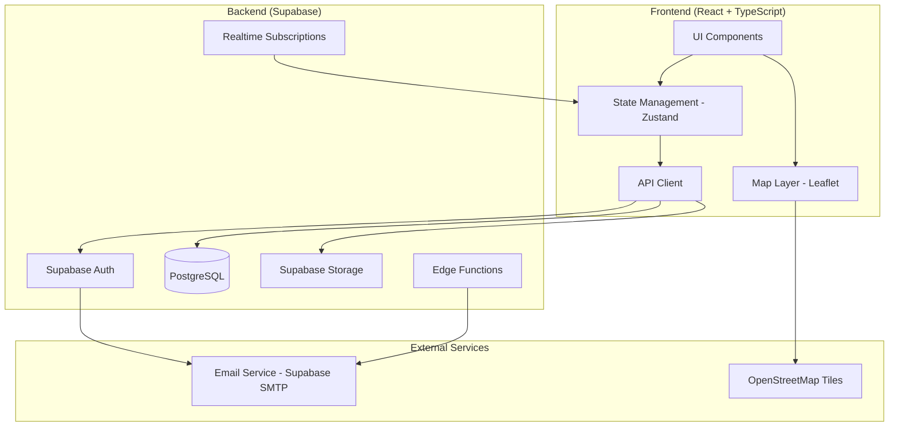
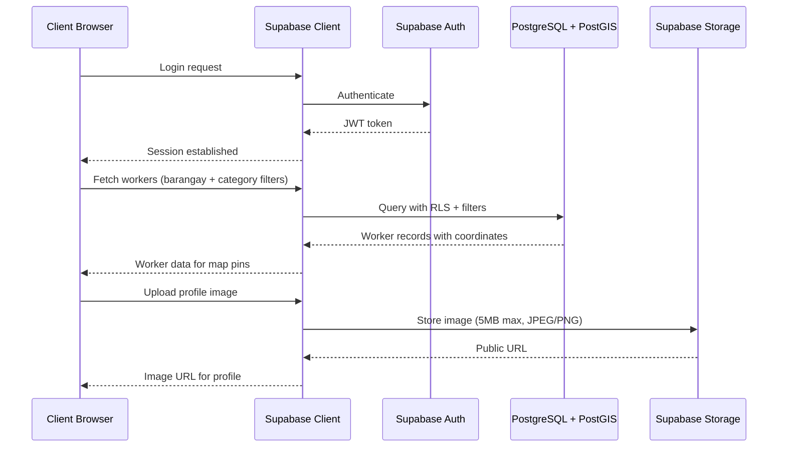
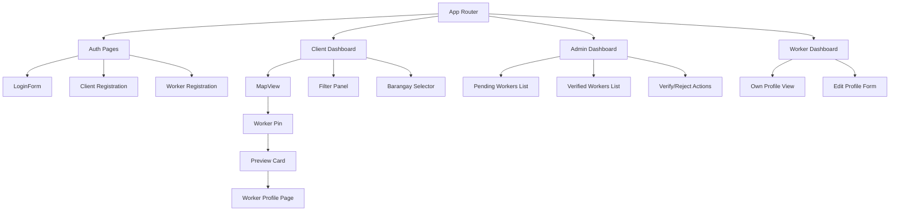
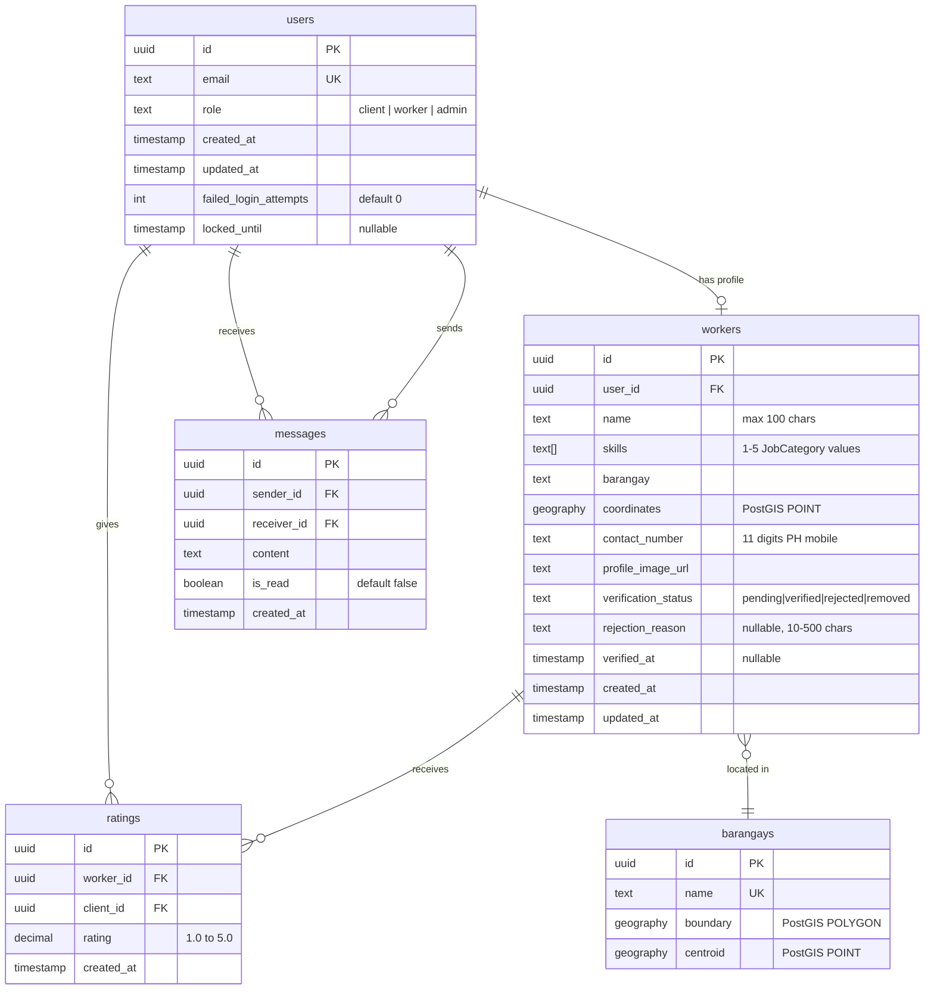

# Design Document: BarangayWorks

## Overview

BarangayWorks is a geo-based skilled worker marketplace web application for Quezon City, Philippines. The system connects clients seeking skilled labor (plumber, electrician, carpenter, mason, laborer) with verified workers in specific barangays through an interactive map interface.

The application follows a three-tier architecture with a React frontend, Node.js/Express backend, and Supabase (PostgreSQL) database. The map interface uses Leaflet with OpenStreetMap tiles. Authentication is handled via Supabase Auth with email-based flows.

### Key Design Decisions

1. **Supabase as Backend-as-a-Service**: Provides PostgreSQL, authentication, real-time subscriptions, and storage in a single platform, reducing infrastructure complexity for a hackathon project.
2. **Leaflet over Google Maps**: Open-source, no API key costs, and sufficient for the pin-based display requirements.
3. **React with TypeScript**: Type safety for data models, component props, and API contracts.
4. **Mobile-first CSS with Tailwind**: Utility-first approach enables rapid responsive development from 320px to 1920px.
5. **GeoJSON barangay boundaries**: Pre-loaded boundary data for Quezon City barangays enables client-side zoom and filtering without additional API calls.

## Architecture



### Architecture Layers

1. **Presentation Layer**: React components with Tailwind CSS, Leaflet map integration, role-based routing
2. **State Layer**: Zustand store for client-side state (filters, selected barangay, auth state, map viewport)
3. **Data Access Layer**: Supabase client SDK for database queries, auth operations, and file uploads
4. **Database Layer**: PostgreSQL with PostGIS extension for geographic queries, Row Level Security (RLS) policies
5. **Infrastructure Layer**: Supabase platform (auth, database, storage, edge functions, realtime)

### Request Flow



## Components and Interfaces

### Frontend Components



### Key Component Interfaces

```typescript
// Authentication
interface AuthService {
  registerClient(data: ClientRegistrationData): Promise<AuthResult>;
  registerWorker(data: WorkerRegistrationData): Promise<AuthResult>;
  login(email: string, password: string): Promise<AuthResult>;
  logout(): Promise<void>;
  confirmEmail(token: string): Promise<AuthResult>;
  getCurrentUser(): Promise<User | null>;
}

interface ClientRegistrationData {
  email: string;
  password: string; // 8-128 chars, uppercase, lowercase, digit
}

interface WorkerRegistrationData {
  name: string; // max 100 chars
  email: string;
  password: string; // min 8 chars
  skills: JobCategory[]; // 1-5 items
  barangay: string;
  contactNumber: string; // PH mobile, 11 digits
  profileImage: File; // max 5MB, JPEG/PNG
}

// Map and Filtering
interface MapService {
  getWorkerPins(filters: WorkerFilters): Promise<WorkerPin[]>;
  getWorkerPreview(workerId: string): Promise<WorkerPreview>;
  getWorkerProfile(workerId: string): Promise<WorkerProfile>;
}

interface WorkerFilters {
  barangay?: string;
  categories?: JobCategory[];
}

interface WorkerPin {
  id: string;
  latitude: number;
  longitude: number;
  primarySkill: JobCategory;
  isVerified: boolean;
}

interface WorkerPreview {
  id: string;
  name: string;
  primarySkill: JobCategory;
  averageRating: number | null;
  isVerified: boolean;
}

interface WorkerProfile {
  id: string;
  name: string;
  profileImageUrl: string;
  skills: JobCategory[];
  barangay: string;
  averageRating: number | null;
  isVerified: boolean;
  contactNumber: string;
}

// Admin Verification
interface AdminService {
  getPendingWorkers(): Promise<PendingWorker[]>;
  getVerifiedWorkers(): Promise<VerifiedWorker[]>;
  approveWorker(workerId: string): Promise<void>;
  rejectWorker(workerId: string, reason: string): Promise<void>;
  removeWorker(workerId: string, reason: string): Promise<void>;
}

// Enums and Types
type JobCategory = 'plumber' | 'electrician' | 'carpenter' | 'mason' | 'laborer';

type VerificationStatus = 'pending' | 'verified' | 'rejected' | 'removed';

type UserRole = 'client' | 'worker' | 'admin';
```

### API Endpoints (Supabase RPC + REST)

| Endpoint | Method | Description | Auth Required |
|----------|--------|-------------|---------------|
| `/auth/signup` | POST | Register client or worker | No |
| `/auth/signin` | POST | Login | No |
| `/auth/confirm` | GET | Email confirmation | No |
| `/rest/v1/workers?status=eq.verified` | GET | Get verified workers | Yes |
| `/rest/v1/workers?barangay=eq.{name}&skills=cs.{categories}` | GET | Filtered workers | Yes |
| `/rest/v1/workers?id=eq.{id}` | GET | Worker profile | Yes |
| `/rest/v1/workers?status=eq.pending&order=created_at.asc` | GET | Pending workers (admin) | Admin |
| `/rest/v1/rpc/approve_worker` | POST | Approve worker | Admin |
| `/rest/v1/rpc/reject_worker` | POST | Reject worker with reason | Admin |
| `/rest/v1/rpc/remove_worker` | POST | Remove verified worker | Admin |
| `/storage/v1/object/profiles/{id}` | POST | Upload profile image | Yes |

## Data Models

### Database Schema (PostgreSQL + PostGIS)



### Key Database Constraints

```sql
-- Password validation handled at application layer (Supabase Auth)
-- 8-128 chars, at least 1 uppercase, 1 lowercase, 1 digit

-- Worker skills constraint
ALTER TABLE workers ADD CONSTRAINT skills_count 
  CHECK (array_length(skills, 1) >= 1 AND array_length(skills, 1) <= 5);

-- Valid job categories
ALTER TABLE workers ADD CONSTRAINT valid_skills 
  CHECK (skills <@ ARRAY['plumber','electrician','carpenter','mason','laborer']::text[]);

-- Contact number format (PH mobile: 09XXXXXXXXX)
ALTER TABLE workers ADD CONSTRAINT valid_contact 
  CHECK (contact_number ~ '^09[0-9]{9}$');

-- Worker name length
ALTER TABLE workers ADD CONSTRAINT name_length 
  CHECK (char_length(name) <= 100);

-- Rating range
ALTER TABLE ratings ADD CONSTRAINT valid_rating 
  CHECK (rating >= 1.0 AND rating <= 5.0);

-- Rejection reason length
ALTER TABLE workers ADD CONSTRAINT rejection_reason_length 
  CHECK (rejection_reason IS NULL OR 
    (char_length(rejection_reason) >= 10 AND char_length(rejection_reason) <= 500));

-- Account lockout
ALTER TABLE users ADD CONSTRAINT valid_failed_attempts 
  CHECK (failed_login_attempts >= 0 AND failed_login_attempts <= 5);
```

### Row Level Security (RLS) Policies

```sql
-- Workers table: anyone authenticated can read verified workers
CREATE POLICY "Verified workers are viewable by authenticated users"
  ON workers FOR SELECT
  USING (auth.role() = 'authenticated' AND verification_status = 'verified');

-- Workers table: workers can read their own profile regardless of status
CREATE POLICY "Workers can view own profile"
  ON workers FOR SELECT
  USING (auth.uid() = user_id);

-- Workers table: admins can read all workers
CREATE POLICY "Admins can view all workers"
  ON workers FOR SELECT
  USING (EXISTS (SELECT 1 FROM users WHERE id = auth.uid() AND role = 'admin'));

-- Workers table: admins can update verification status
CREATE POLICY "Admins can update worker status"
  ON workers FOR UPDATE
  USING (EXISTS (SELECT 1 FROM users WHERE id = auth.uid() AND role = 'admin'));

-- Workers table: workers can update their own profile fields
CREATE POLICY "Workers can update own profile"
  ON workers FOR UPDATE
  USING (auth.uid() = user_id)
  WITH CHECK (auth.uid() = user_id);
```

### Barangay Data Structure

```typescript
// Pre-loaded GeoJSON for Quezon City barangays
interface BarangayGeoJSON {
  type: 'FeatureCollection';
  features: BarangayFeature[];
}

interface BarangayFeature {
  type: 'Feature';
  properties: {
    name: string;
    id: string;
  };
  geometry: {
    type: 'Polygon' | 'MultiPolygon';
    coordinates: number[][][];
  };
}
```

## Correctness Properties

*A property is a characteristic or behavior that should hold true across all valid executions of a system — essentially, a formal statement about what the system should do. Properties serve as the bridge between human-readable specifications and machine-verifiable correctness guarantees.*

### Property 1: Password validation accepts only compliant passwords

*For any* string, the password validation function SHALL accept it if and only if it is between 8 and 128 characters long and contains at least one uppercase letter, one lowercase letter, and one digit.

**Validates: Requirements 1.1**

### Property 2: Email validation correctly classifies email formats

*For any* string, the email validation function SHALL accept it if and only if it conforms to a valid email format (contains exactly one @ symbol with non-empty local and domain parts, domain contains at least one dot).

**Validates: Requirements 1.3**

### Property 3: Account lockout triggers at exactly 5 consecutive failures

*For any* sequence of login attempts for a given account, the account SHALL become locked if and only if there are 5 or more consecutive failed attempts without an intervening successful login, and a successful login SHALL reset the failure counter to zero.

**Validates: Requirements 1.6**

### Property 4: Worker registration validation reports all field errors

*For any* worker registration submission with N invalid or missing fields, the validation function SHALL return exactly N error messages, one per invalid field, and SHALL accept the submission only when all fields pass their respective constraints (name ≤ 100 chars, 1-5 skills from JobCategory, 11-digit PH mobile, image ≤ 5MB JPEG/PNG).

**Validates: Requirements 2.1, 2.4**

### Property 5: Barangay-to-coordinates mapping produces valid Quezon City coordinates

*For any* valid barangay name from the Quezon City barangay list, the coordinate lookup function SHALL return geographic coordinates (latitude, longitude) that fall within the bounding box of Quezon City (approximately 14.58°N to 14.78°N latitude, 121.0°E to 121.12°E longitude).

**Validates: Requirements 2.3**

### Property 6: Pending workers list is always sorted by registration date ascending

*For any* list of pending worker registrations, the dashboard display function SHALL return them sorted such that for every adjacent pair (worker_i, worker_j), worker_i.created_at ≤ worker_j.created_at.

**Validates: Requirements 3.3**

### Property 7: Barangay substring filter returns exactly matching results

*For any* search string of at least 1 character and any list of barangay names, the filter function SHALL return all and only those barangay names that contain the search string as a case-insensitive substring.

**Validates: Requirements 4.1**

### Property 8: Combined worker filter returns only workers matching all active criteria

*For any* set of workers, any optional barangay selection, and any optional set of selected job categories, the filter function SHALL return all and only those workers where: (1) verification_status equals "verified", AND (2) if a barangay is selected, worker.barangay equals the selected barangay, AND (3) if categories are selected, the worker has at least one skill in the selected categories.

**Validates: Requirements 4.3, 5.2, 6.2, 6.6, 8.6**

### Property 9: Clearing barangay selection restores full verified worker set

*For any* initial set of verified workers and any barangay selection, applying the barangay filter and then clearing it SHALL produce the same set of visible workers as the initial unfiltered state.

**Validates: Requirements 4.5**

### Property 10: Preview card contains all required worker information

*For any* verified worker with complete profile data, the preview card rendering function SHALL produce output containing the worker's name, primary skill (first skill in their list), average rating (or "No ratings yet" if null), verification status, and a contact action button.

**Validates: Requirements 5.3, 11.2**

### Property 11: Worker profile display contains all required fields with correct formatting

*For any* worker profile data, the profile rendering function SHALL produce output containing the worker's name, profile image URL, all skills, barangay, verification badge, and rating formatted as a number with exactly one decimal place (or "No ratings yet" if no ratings exist).

**Validates: Requirements 2.2, 7.2**

### Property 12: Rejection reason validation enforces length constraints

*For any* string, the rejection reason validation function SHALL accept it if and only if its character length is between 10 and 500 inclusive.

**Validates: Requirements 8.2**

## Error Handling

### Error Categories and Responses

| Category | Scenario | User-Facing Response | Technical Action |
|----------|----------|---------------------|------------------|
| Authentication | Invalid credentials | "Invalid email or password" (generic) | Log attempt, increment failure counter |
| Authentication | Account locked | "Account temporarily locked. Try again in 15 minutes" | Return 429 with retry-after header |
| Authentication | Unconfirmed email | "Please confirm your email before logging in" | Resend confirmation option |
| Validation | Invalid form fields | Per-field error messages | Return 400 with field-level errors |
| Validation | File too large | "Image must be under 5MB" | Reject upload client-side before submission |
| Validation | Invalid file type | "Only JPEG and PNG images are accepted" | Reject upload client-side |
| Network | API timeout | "Connection timed out. Please try again" | Retry with exponential backoff (max 3 attempts) |
| Network | Map tiles fail | Show cached tiles or placeholder | Fallback to cached tile layer |
| Data | Worker profile not found | "This profile is no longer available" | Redirect to map view |
| Data | No workers in area | "No workers available in this area" | Show empty state with suggestion |
| Authorization | Unauthorized access | Redirect to login | Clear session, redirect to /login |
| Authorization | Forbidden action | "You don't have permission for this action" | Log unauthorized attempt |

### Error Handling Strategy

```typescript
// Centralized error handler
interface AppError {
  code: string;
  message: string;
  field?: string; // For validation errors
  retryable: boolean;
}

// Client-side validation runs first (instant feedback)
// Server-side validation is authoritative (security)
// Network errors trigger retry with backoff
// Auth errors clear session and redirect
```

### Graceful Degradation

1. **Map tiles unavailable**: Display cached tiles or a static fallback image with worker list view
2. **Real-time updates fail**: Fall back to polling every 30 seconds
3. **Image upload fails**: Allow text-only profile creation, prompt image upload later
4. **Geolocation unavailable**: Default to city-center view, rely on barangay selection

## Testing Strategy

### Testing Approach

The testing strategy uses a dual approach combining property-based tests for universal correctness guarantees with example-based tests for specific scenarios and integration points.

### Property-Based Tests

**Library**: [fast-check](https://github.com/dubzzz/fast-check) (TypeScript property-based testing)
**Configuration**: Minimum 100 iterations per property test

Each property test references its design document property:

| Property | Test Target | Generator Strategy |
|----------|-------------|-------------------|
| Property 1: Password validation | `validatePassword()` | Random strings (0-200 chars, various character sets) |
| Property 2: Email validation | `validateEmail()` | Random strings with/without @, dots, valid/invalid formats |
| Property 3: Account lockout | `LoginAttemptTracker` | Random sequences of success/failure attempts |
| Property 4: Worker registration | `validateWorkerRegistration()` | Random worker data with valid/invalid field combinations |
| Property 5: Barangay coordinates | `getBarangayCoordinates()` | Random valid barangay names from the list |
| Property 6: Pending sort order | `sortPendingWorkers()` | Random worker arrays with random dates |
| Property 7: Barangay substring filter | `filterBarangays()` | Random search strings + random barangay name lists |
| Property 8: Combined worker filter | `filterWorkers()` | Random worker sets + random filter combinations |
| Property 9: Filter clear round-trip | `filterWorkers()` | Random workers, apply filter, clear, compare |
| Property 10: Preview card | `renderPreviewCard()` | Random worker profile data |
| Property 11: Profile display | `renderWorkerProfile()` | Random worker profile data with/without ratings |
| Property 12: Rejection reason | `validateRejectionReason()` | Random strings (0-1000 chars) |

**Tag format**: `// Feature: barangay-works, Property {N}: {title}`

### Unit Tests (Example-Based)

- Login redirect behavior (client → Map_View, admin → Dashboard)
- Duplicate email registration error
- Generic error messages (no field leakage)
- Empty state displays (no pending workers, no workers in area)
- Preview card dismiss on outside click
- Clear-all filter button behavior
- Call button href format (`tel:09XXXXXXXXX`)
- Chat button navigation
- Role-based dashboard routing
- Responsive breakpoint behavior (768px collapse)

### Integration Tests

- Full registration → email confirmation → login flow
- Worker registration → admin approval → pin appears on map
- Worker registration → admin rejection → email notification
- Combined filter (barangay + category) with real database queries
- Profile image upload → storage → URL in profile
- Real-time pin appearance after admin approval (within 5 seconds)

### End-to-End Tests

- Three-click worker discovery path (Requirement 11)
- Complete worker lifecycle: register → verify → appear on map → get contacted
- Account lockout and recovery flow

### Performance Tests

- Map load time < 3 seconds on 10 Mbps (Requirement 5.5)
- Filter update < 500ms (Requirement 6.3)
- Profile page load < 2 seconds (Requirement 7.1)
- Dashboard load < 3 seconds (Requirement 9.1-9.3)
- Lighthouse mobile score ≥ 70 (Requirement 10.4)

### Accessibility Tests

- Minimum 44x44px tap targets (Requirement 10.2)
- No horizontal scroll 320px-1920px (Requirement 10.1)
- Keyboard navigation for all interactive elements
- Screen reader compatibility for map pins and filter controls
